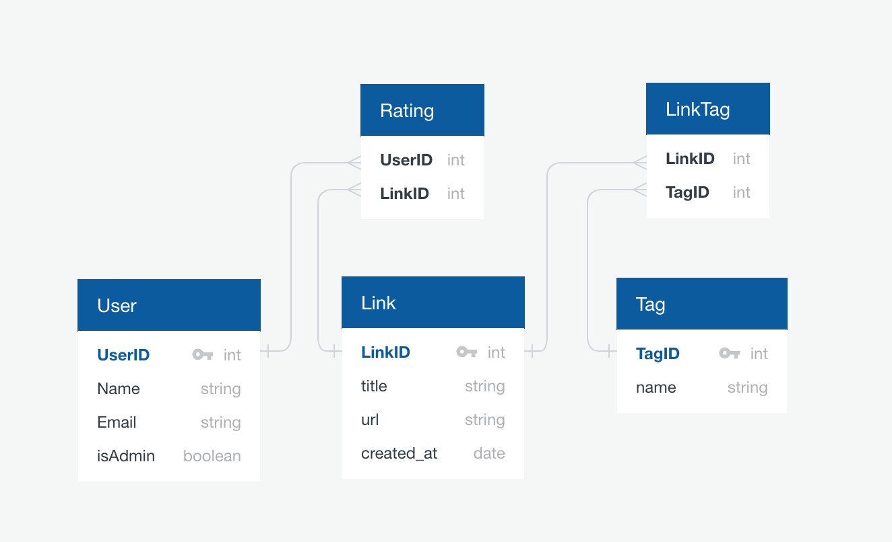

# Shrike Videos API

## Usage

Run with `npm start`. 

### Development

Start `gulp` and run `npm run dev`. 

Create database `shrike-videos` on postgres.

Run migrations with `npm run migrate`.

Run seeds with `npm run seed`.

## Deployment to Heroku

[Link](https://shrike-videos.herokuapp.com/)

```
git subtree push --prefix server heroku master
# or to force changes
git push heroku `git subtree split --prefix server master`:master --force
heroku run npm run migrate
heroku run npm run seed
heroku open
```

## ERD


